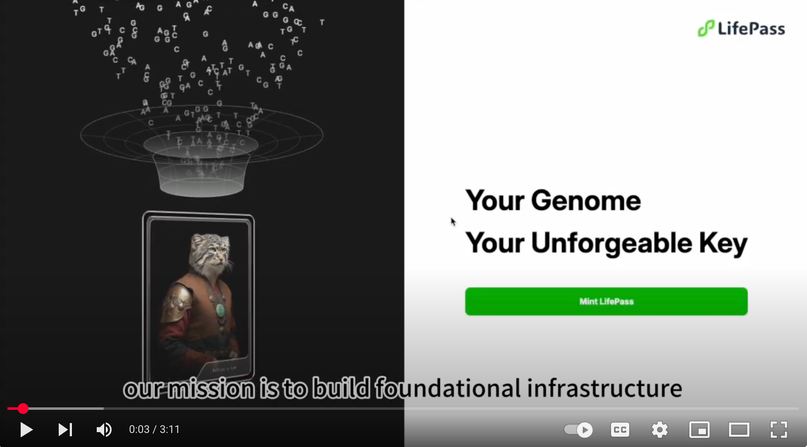

# lifePass DID

**lifePass** ([https://pass.dlife.xyz](https://pass.dlife.xyz)) is a human-layer DID protocol powered by cutting-edge omics technologies and AI models. It is designed to support fast-growing decentralized science (DeSci) and longevity-focused projects within the Web3 community.

<figure><figcaption>
<a href="https://www.youtube.com/watch?v=zX4dqMphqls">lifePass introduction Video</a>
</figcaption></figure>
