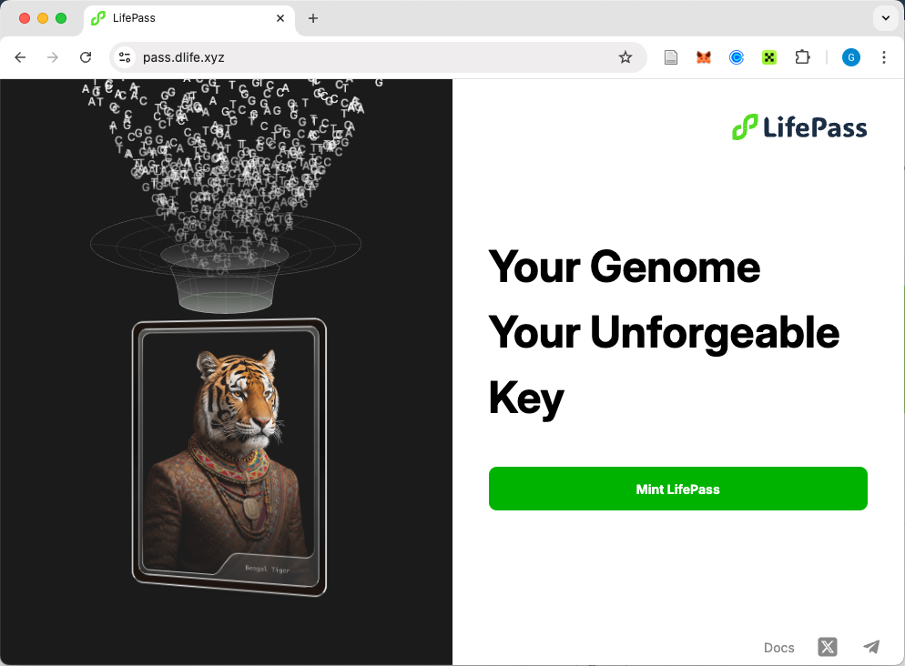

# How to mint my lifePass?

## Get Started

<figure><figcaption>
lifePass Homepage
</figcaption></figure>

1. Connect your wallet to lifePass
2. Pay the gas fee to mint your NFT
3. Upload your genome data in TXT format
4. Wait ~30 minutes for bioinformatics analysis
5. Showcase your first genome-based NFT to the world

## Personal Genome Data

Currently, lifePass supports raw data from following personal genome testing service providers:

* 23andme
  * Since there are five different versions of [23andme](https://www.23andme.com) chips, lifePass is optimized for the V5 version. More information about 23andme data version can be found [here](https://customercare.23andme.com/hc/en-us/articles/218392668-Upgrading-to-23andMe-s-Newest-Chip-Version).
* WeGene
  * Login into [WeGene] (https://www.wegene.com/en/) and switch to the Chinese user interface. Click "个人中心" and download "核心数据" to get the raw data of your genome.
* DNALL
* DNAset
* KeyGene

If you encounter any difficulties purchasing the genetic testing service, you can contact @xxxx on Telegram to make the purchase using cryptocurrency.

## Upload Your Genome Data to lifePass
