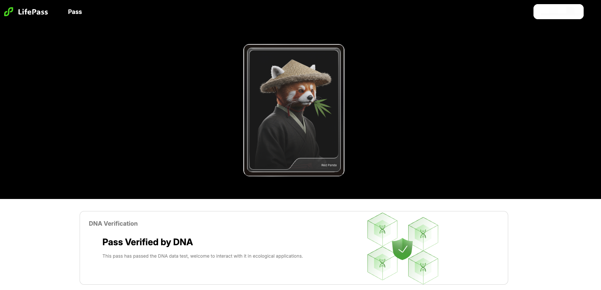

# What is lifePass?

## Introduction

**lifePass** ([https://pass.dlife.xyz](https://pass.dlife.xyz)) is a human-layer DID protocol powered by cutting-edge omics technologies and AI models. It is designed to support fast-growing decentralized science (DeSci) and longevity-focused projects within the Web3 community.

<figure><figcaption>
A demo lifePass profile
</figcaption></figure>

Key features of lifePass:

* The most reliable decentralized Proof-of-Human infrastructure
* Self-custody of personal genomic data enabled by blockchain and encryption technologies
* Genomic data infrastructure based on Zero-Knowledge (ZK) technology, supporting applications and research while protecting user privacy and data security
* Decentralized infrastructure for AI-powered analysis and interpretation of personal genomic data

## Ancestry

The default ancestry composition analysis provided by lifePass includes 13 typical populations:
* East Asian
* Siberian
* Amerindian
* South Asian
* North European
* Artic
* Palaeo African
* West African
* Southwest Asian
* Mediterranean
* Australasian
* West Asian
* East African

Admixture algorithm is applied to your genome data to conduct the ancestry composition analysis. Results will be returned as labels associated to your LifePass's NFT.

## Genetic Attributes
Currently, genetic attributes are categorized into four main areas:

### Health Risk

Genetic predisposition to specific conditions, calculated using Polygenic Risk Scores (PRS).
Example: Depression

### Genetic Traits

Phenotypic characteristics influenced by genetic variation.

Examples:
* Bitter taste sensitivity
* Smoking behavior
* Male sexual orientation tendencies
* ApoE genotyping

### Nutritional Genomics

Insights into how genes affect the body's response to nutrients.
Examples:

* Caffeine metabolism
* Lactose intolerance
* Alcohol metabolism

### Pharmacogenomics (PGx)

How genetic variation affects drug response and metabolism.
Example: Simvastatin

## Contributions

Initial idea was proposed by Wayne from Axia8 Venture.

Product is designed by David, Weibo and Walker from dLife, and Void, who is the leader of a Web3 development team.

Smart contracts is developed by a skilled Web3 development team lead by Void. The bioinformatics part is developed by a professional team lead by Senwei from WeGene.

## Acknowledgement
