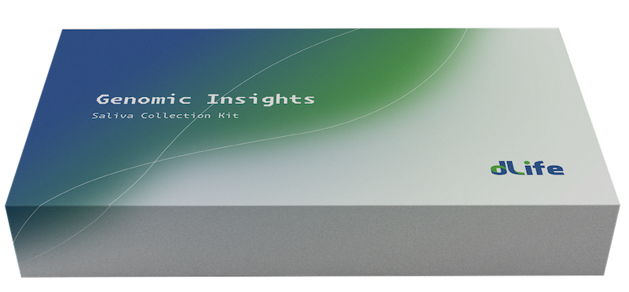

dLife is collaborating with trusted service providers to offer personal multi-omics testing, helping users join and engage with the dLife ecosystem.

Currently, dLife and its partners provide personal genome and epigenome tests. In the near future, dLife plans to expand its testing services to include blood tests, metabolome tests, and more.

<figure><figcaption>
dLife Personal Genome Test Kit
</figcaption></figure>

<figure><figcaption>
dLife Personal Epigenome Test Kit
</figcaption></figure>
