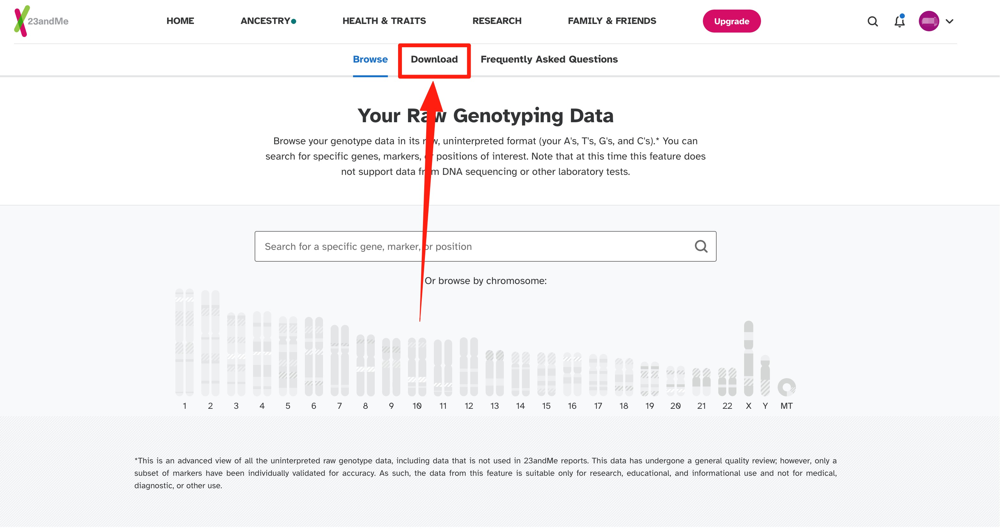
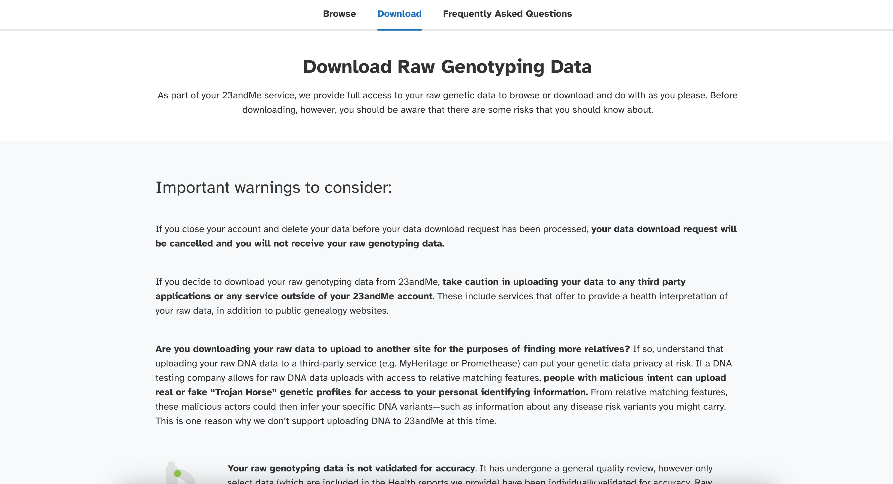
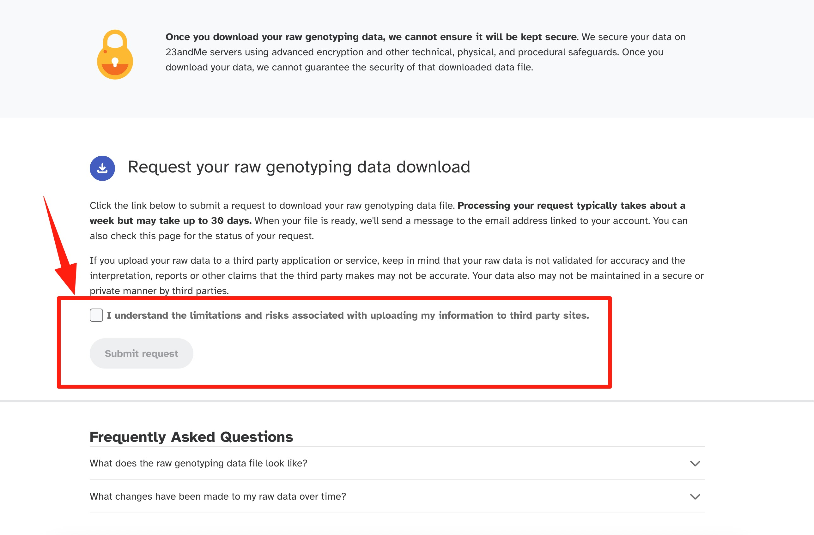
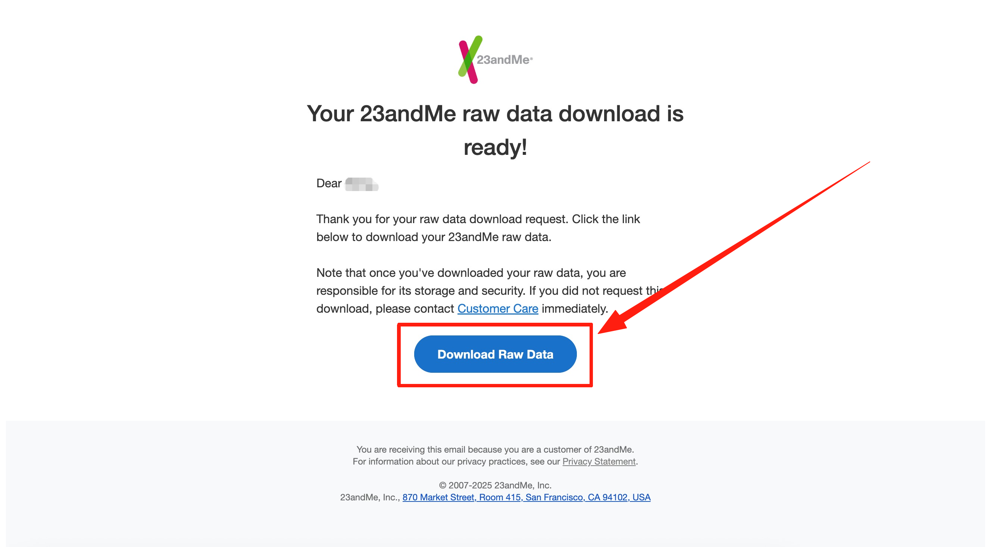
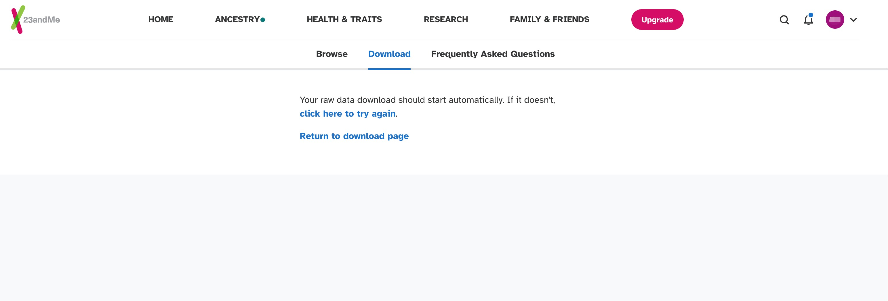

# LifePass Claim Tutorial (23andMe)

> This tutorial is only for users who have undergone genetic testing on 23andme.
> 
1. First visit the 23andme official website [https://www.23andme.com/](https://www.23andme.com/) and log in. Then click on the avatar in the upper right corner to bring up the drop-down menu and select **Resources.**

2. From the page that opens, select **Browse Data.**

3. Select **Download** in the tab bar at the top of the new page.

4. Then you will see some agreements and warning messages, slide to the bottom of the page and check **"I understand..."**

5. For security reasons, 23andme needs to review users' requests for downloading the original data source and notify them through their email after the review. Please wait patiently and check your email in a timely manner.

6. After about 3 working days, you will receive an email notification from 23andme in your mailbox. Please check the email in your mailbox, click **Download Raw Data** , and return to the 23andme page for information verification.

7. You need to verify your identity on the 23andme page (usually date of birth), please verify according to the information you registered and submitted, enter your date of birth and click **Confirm** .

8. Once verified, you will go to the download page and click on **Download raw genotyping data** to download your original data source. If there is no response after clicking the button, please **click here to try again** , and your download will start and download a **.zip** file.

*Click "Download Raw Data" button*

*If download doesn't start, click "Restore Download"*

9. Extract the **.zip** file you downloaded, and the extracted file is your .txt gene metadata. After receiving the .txt file, you can refer to the [instructions](https://www.notion.so/LifePass-Claim-Tutorial-WeGene-24d2450ef1068069aee5e0957c1f991f?pvs=21) to mint your LifePass.
