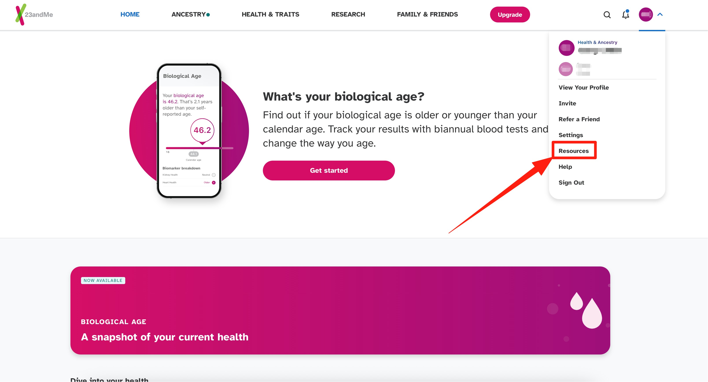
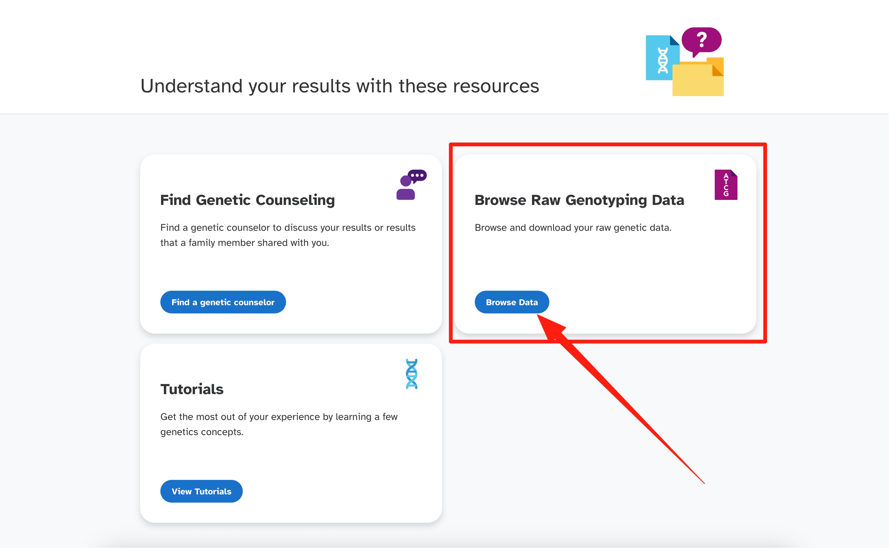
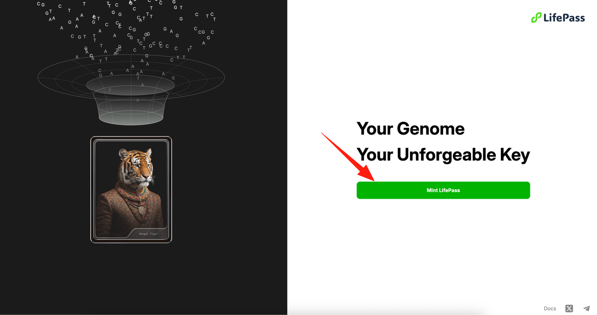

# LifePass 申领教程（23andMe）

> 本教程仅适用于已经在 23andMe 进行过基因检测的用户。
> 

1. 首先访问 23andMe 官方网站 [https://www.23andme.com/](https://www.23andme.com/) 并登录。然后点击右上角的头像调出下拉菜单，选择 **Resources**。

2. 从打开的页面中，选择 **Browse Data**。

3. 在新页面顶部的标签栏中选择 **Download**。

4. 然后您会看到一些协议和警告信息，滑动到页面底部并勾选 **"I understand..."**

5. 出于安全考虑，23andMe 需要审核用户下载原始数据源的请求，并在审核后通过邮件通知用户。请耐心等待并及时查看您的邮箱。

6. 大约3个工作日后，您将在邮箱中收到来自 23andMe 的邮件通知。请查看邮箱中的邮件，点击 **Download Raw Data**，然后返回 23andMe 页面进行信息验证。

7. 您需要在 23andMe 页面上验证您的身份（通常是出生日期），请根据您注册时提交的信息进行验证，输入您的出生日期并点击 **Confirm**。

8. 验证通过后，您将进入下载页面，点击 **Download raw genotyping data** 下载您的原始数据源。如果点击按钮后没有反应，请 **click here to try again**，您的下载将开始并下载一个 **.zip** 文件。

*点击 "Download Raw Data" 按钮*

*如果下载没有开始，点击 "Restore Download"*

9. 解压您下载的 **.zip** 文件，解压后的文件就是您的 .txt 基因元数据。在获得您的核心数据文件后，请访问 https://pass.dlife.xyz/，然后点击 **Mint LifePass** 进行 LifePass 的申领流程。

10. 当前 LifePass NFT 尚未公开发布，我们的 NFT 暂时部署在 BNB Testnet 上，您需要连接您的钱包才能申领 LifePass。

11. 登录钱包后，请确保您选择了 **Binance Smart Chain Testnet**，随后点击 **Open Profile** 进入申领页面。若您需要 Testnet 的测试网代币，请访问 https://www.bnbchain.org/en/testnet-faucet 进行获取。

12. 在申领前，您需要上传您的核心数据。您的数据将被进行加密处理，以确保您的数据安全。

13. 在正式上传数据之前，请您勾选同意我们的相关政策及条例，随后选择之前下载的 **.txt** 文件并上传。

14. 随后您的核心数据将被上传，您可以随时查看上传进度。

15. 在数据上传成功后，我们需要对核心数据进行加密及其他处理，请您耐心等候。您也可以暂离 30 分钟左右再回来查看，数据不会丢失。处理完成后，您就可以在该页面查看您的 LifePass 了！

