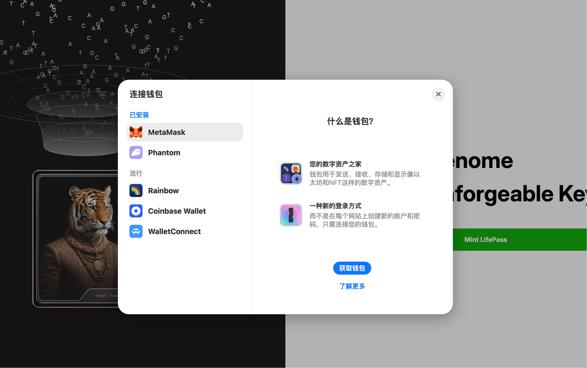
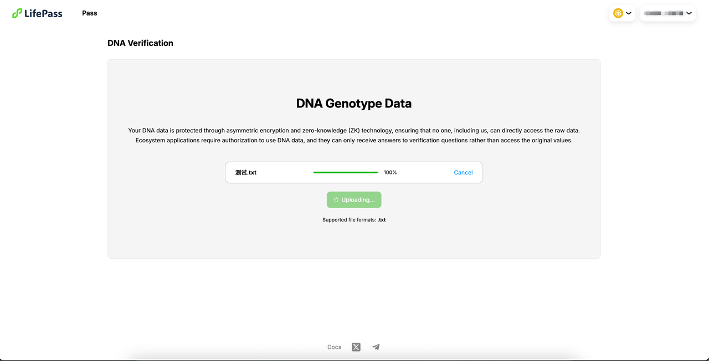
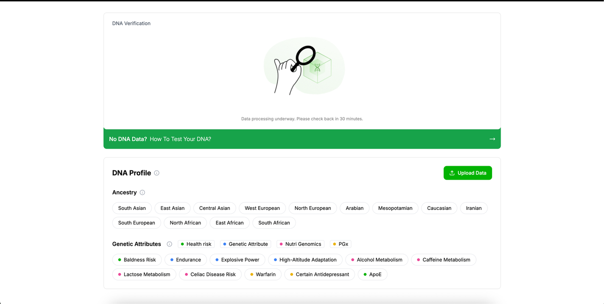

# LifePass Claim Tutorial (WeGene)

> This tutorial is only for LifePass claiming. For genetic testing kit and WeGene® genetic testing tutorials, please follow the instructions in the kit you received. You can also visit WeGene®'s official WeChat account, select Service -> Bind Collection Tube from the bottom menu, and follow the guidance.
> 
> 
> *If you have already sent out the collection tube, please wait patiently for WeGene®'s notification regarding the testing status. Once completed, you can claim your LifePass through this tutorial.*
> 

<aside>
💡

WeGene® only provides core data related services for LifePass. WeGene® is committed to promoting global population genomics research and application, and is a leading genomics team in the country.

</aside>

Dear users, after receiving notification from WeGene®, please visit WeGene's official website https://www.wegene.com/, log in using the phone number and identity information you submitted when binding the collection tube, and complete your personal information after logging in.

Then please follow the steps below:

1. Click "**Personal Center**" in the upper right corner of the webpage to enter the following page. Then select "**Core Data Download**".

2. For the security of your personal information, we will verify your information before downloading. Please use an appropriate method for security verification.

3. Select your preferred **verification method**, obtain the verification code, then enter the verification code and click **Confirm**. The core genetic data may be large, so you need to wait patiently.

4. After the core data download is successful, you can leave the page. Then find the **.txt file** named after you in your download directory, which is your core data.

5. After obtaining your core data file, please visit https://pass.dlife.xyz/, then click **Mint LifePass** to start the LifePass claiming process.

6. Currently, LifePass NFT has not been publicly released. Our NFT is temporarily deployed on BNB Testnet, and you need to connect your wallet to claim LifePass.

7. After logging into your wallet, please ensure you have selected **Binance Smart Chain Testnet**, then click **Open Profile** to enter the claiming page. If you need Testnet tokens, please visit https://www.bnbchain.org/en/testnet-faucet to obtain them.

8. Before claiming, you need to upload your core data. Your data will be encrypted to ensure data security.

9. Before formally uploading data, please check to agree to our relevant policies and regulations, then select and upload the **.txt file** you downloaded earlier.

10. Your core data will then be uploaded, and you can check the upload progress at any time.

11. After the data is successfully uploaded, we need to encrypt and process the core data. Please wait patiently. You can also leave for about 30 minutes and come back to check, as the data will not be lost. Once processing is complete, you can view your LifePass on this page!

