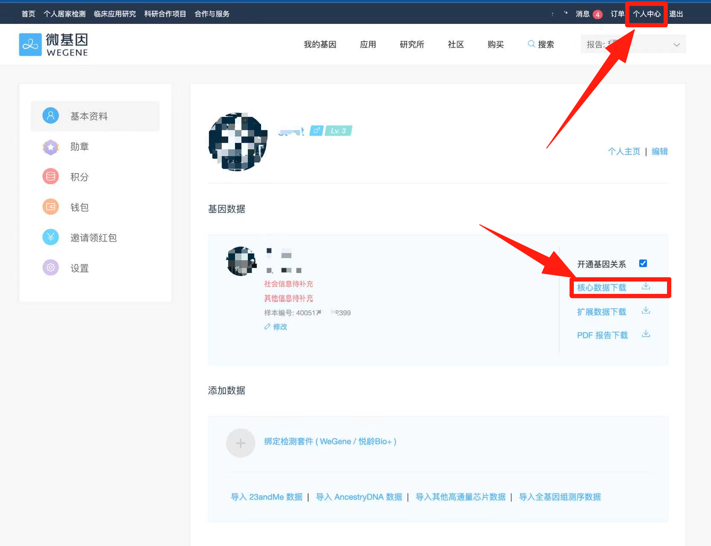
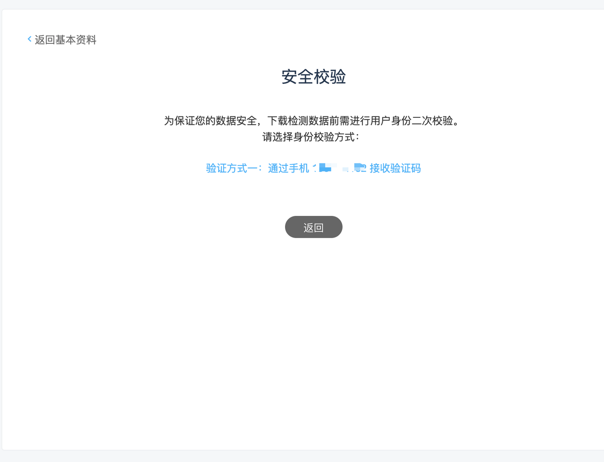
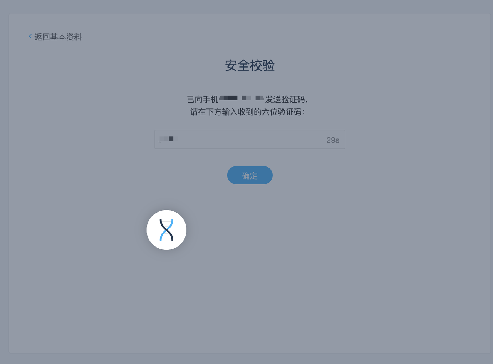
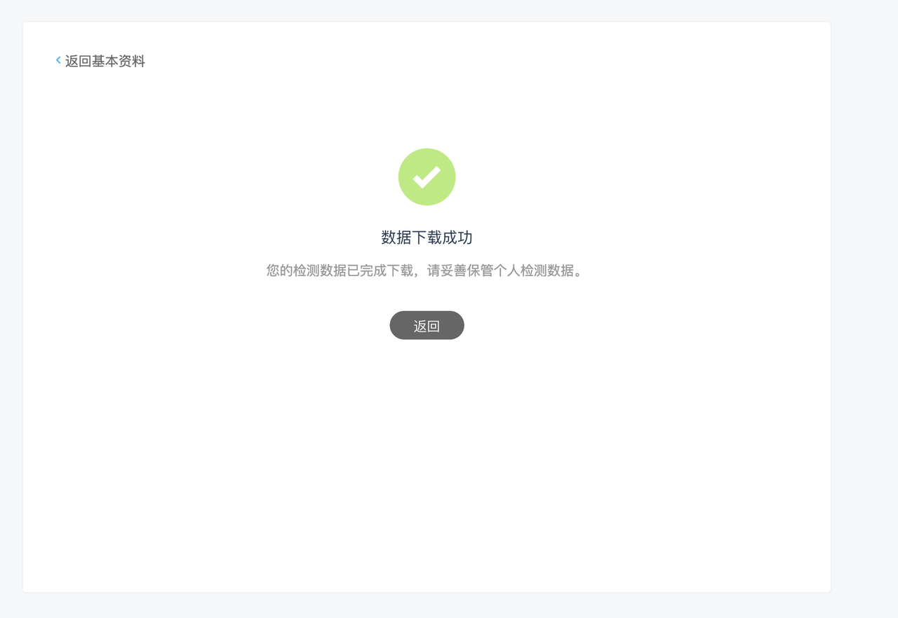

# LifePass 申领教程（微基因）

> 本文仅为Lifepass申领的教程，基因检测工具包及微基因®对基因进行检测的教程请按照您收到的工具包内说明指引进行。您也可以访问微基因®的公众号，在底部菜单选择服务->绑定采集管，随后跟随引导进行。
> 
> 
> *若您已寄出采集管，请耐心等候微基因®有关检测状态的通知，在完成后即可通过该教程申领LifePass。*
> 

<aside>
💡

微基因®仅对LifePass 提供核心数据相关服务，微基因 WeGene® 致力于推动全球群体基因组学的研究和应用，是全国领先的基因组学团队。

</aside>

尊敬的用户，在您收到来自微基因®的通知后，请访问微基因的官方网站 https://www.wegene.com/，使用您在绑定采集管时提交的手机号及身份信息进行登录，并在登录后完善您的个人信息。

随后请参照下列步骤执行

1. 在网页右上角点击"**个人中心**"，进入到如下页面。随后选择"**核心数据下载**"。

2. 为了您的个人信息安全，在下载之前我们会对您的信息进行校验，请通过合适的方式进行安全校验。

3. 选择您偏好的**验证方式**，并获取验证码，随后输入验证码并点击**确定**。基因的核心数据可能较大，您需要耐心等待一会儿。

4. 核心数据下载成功后，您就可以离开该页面。随后在您的下载目录中找到以您名字命名的 **.txt 文件**，即为您的核心数据。

5. 在获得您的核心数据文件后，烦请挪步访问 https://pass.dlife.xyz/，随后点击 **Mint LifePass** 进行 LifePass 的申领流程。

6. 当前 LifePass NFT 尚未公开发布，我们的 NFT 暂时部署在 BNB Testnet 上，您需要连接您的钱包才能申领 LifePass。

7. 登录钱包后，请确保您选择了 **Binance Smart Chain Testnet，**随后点击 **Open Profile** 进入申领页面。若您需要 Testnet 的测试网代币，请挪步 https://www.bnbchain.org/en/testnet-faucet 进行获取。

8. 在申领前，您需要上传您的核心数据。您的数据将被进行加密处理，以确保您的数据安全。

9. 在正式上传数据之前，请您勾选同意我们的相关政策及条例，随后选择之前下载的 **.txt** **文件**并上传。

10. 随后您的核心数据将被上传，您可以随时查看上传进度。

11. 在数据上传成功后，我们需要对核心数据进行加密及其他处理，请您耐心等候。您也可以暂离 30 分钟左右再回来查看，数据不会丢失。处理完成后，您就可以在该页面查看您的 LifePass 了！

